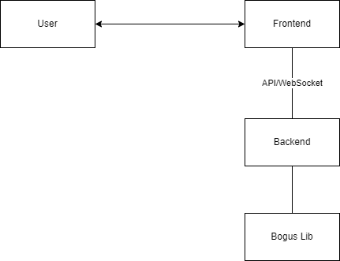

# Talkify

## Contributors

- **[tassan](https://github.com/tassan)**

## License

This project is licensed under the **MIT License**.

## Background Context

**Talkify** is a TDD Sandbox Project designed to explore and showcase Test-Driven Development (TDD) principles in a real-world application. The goal is to build a robust and scalable real-time chat system while adhering to clean code and agile practices.

This project is inspired by the work shared in the [Optivem Journal](https://journal.optivem.com/) and the insights of [Valentina Jemuović](https://substack.com/@valentinajemuovic), encouraging developers to adopt and refine their TDD skills. Check out the links for more details and inspiration.

## Use Cases

### Use Case 1: Real-Time Messaging

#### Actors:

- **Primary Actor**: Registered User
- **Secondary Actor**: System (Talkify Backend)

#### Preconditions:

1. The user must be registered and logged into the system.
2. The user must have an active internet connection.

#### Basic Flow:

1. The user navigates to a chat window.
2. The user types a message into the input box.
3. The user clicks the "Send" button or presses Enter.
4. The system sends the message to the recipient(s) in real-time.
5. The system confirms message delivery by updating the chat UI.

#### Alternative Flows:

- **Unregistered User**: If the user is not registered, the system redirects them to the login or signup page.
- **Offline Recipient**: If the recipient is offline, the system stores the message and delivers it when they reconnect.

#### Exceptional Flows:

- **Message Delivery Failure**: If the message fails to send due to a server error, the system displays an error message and allows the user to retry.

#### Postconditions:

1. The message appears in the recipient's chat window in real-time.
2. The message is stored in the database for future retrieval.

---

### Use Case 2: User Authentication

#### Actors:

- **Primary Actor**: User
- **Secondary Actor**: Authentication Service

#### Preconditions:

1. The user must have an account (for login).
2. The system must have access to the authentication service.

#### Basic Flow:

1. The user enters their email and password into the login form.
2. The user clicks the "Login" button.
3. The system validates the credentials against the authentication service.
4. If valid, the user is granted access to the application.

#### Alternative Flows:

- **Password Reset**: If the user forgets their password, they can initiate a password reset via a "Forgot Password" link.
- **OAuth Login**: The user can log in using an external provider (e.g., Google, GitHub).

#### Exceptional Flows:

- **Invalid Credentials**: If the credentials are invalid, the system displays an error message.
- **Account Locked**: If the account is locked, the system informs the user and provides support contact details.

#### Postconditions:

1. The user gains access to the application.
2. A session is initiated and maintained until logout or timeout.

Here’s an example section for your **System Repository README file** to list and describe the chosen **External Systems**:

---

## External Systems

### 1. External Library (Optional)

- **System Name**: [Bogus](https://github.com/bchavez/Bogus)
  - A library for generating fake data such as usernames, email addresses, and other random values for testing purposes.

Here’s an example section for the **System Architecture Style** to add to your **System Repository README file**:

## System Architecture Style

**Architecture Style**: Frontend + Monolithic Backend

### Description

- The system is designed with a separate frontend application and a monolithic backend.
- The **frontend** handles the user interface and interactions, while the **backend** manages business logic, real-time communication, and data persistence in a centralized codebase.
- This architecture is chosen for simplicity, ease of development, and maintainability, making it ideal for the project's initial scope.

---

### C4 Model Level 1: Context Diagram

#### **Actors and Components**

1. **Actors**:

   - **User (Primary Actor)**: The end-user interacting with the system via the frontend.

2. **System Components**:

   - **Frontend**: Handles user interaction, displays data, and communicates with the backend via API or WebSocket.
   - **Backend**: A monolithic system that handles:
     - Business logic.
     - Data processing and persistence.
     - Real-time communication via SignalR or WebSockets.

3. **External Systems**:
   - **Bogus Library**: Generates test data for development and prototyping.

---

#### **Relationships**

1. **User → Frontend**:

   - The user interacts with the **Frontend** via a browser or mobile app (HTTP/HTTPS).

2. **Frontend → Backend**:

   - The frontend sends requests to the **Backend** for data (REST API or WebSocket).
   - The backend responds with processed data or real-time updates.

3. **Backend → Bogus Library**:
   - The **Backend** uses the **Bogus Library** to generate mock data for testing.

---

### Diagram Description

Here’s the simplified textual diagram outline:

```
+---------------+          HTTPS/REST          +--------------------+
|   User        |  <------------------------> |     Frontend       |
+---------------+                             +--------------------+
                                                      |
                                                      | API/WebSocket
                                                      |
                                              +--------------------+
                                              |     Backend        |
                                              +--------------------+
                                                      |
                                                      |
                                            +--------------------+
                                            |   Bogus Library    |
                                            +--------------------+
```

### Architecture Diagram



## Tech Stack

### Programming Language(s)

- **C#**: For backend development.
- **JavaScript/TypeScript**: For frontend development with React.

### Frameworks

- **ASP.NET Core**: For building the backend REST API and real-time communication using SignalR.
- **React**: For building a dynamic and responsive user interface.

### Database

- **SQLite**: A lightweight, file-based relational database for storing user data, messages, and other persistent information.

### Additional Tools and Libraries

- **SignalR**: For enabling real-time messaging and communication between the frontend and backend.
- **Entity Framework Core**: For object-relational mapping (ORM) and interacting with the SQLite database.
- **xUnit**: For unit testing to ensure reliability through TDD practices.
- **React Router**: For handling routing in the React application.
- **Axios**: For making API requests from the React frontend.

## Repository Strategy

**Chosen Approach**: Multi-Repo

### Description

The project will follow a **Multi-Repo** strategy, with separate repositories for the backend and frontend components.

### Repositories

1. **Backend Repository**:

   - **Technology**: .NET Core
   - **Purpose**: Handles the server-side logic, APIs, real-time communication using SignalR, and data persistence with SQLite.

2. **Frontend Repository**:
   - **Technology**: React
   - **Purpose**: Provides the user interface for interacting with the system, making API calls to the backend.

## Branching Strategy

**Chosen Approach**: Feature Branching

### Description

The project will follow a **Feature Branching** strategy, where:

- Each feature or bug fix is developed in its own dedicated branch.
- Branch names will follow a clear and consistent naming convention, e.g., `feature/<feature-name>` or `bugfix/<bug-name>`.
- Changes are merged into the `main` branch through pull requests after code review and successful CI tests.

This approach allows for:

- Parallel development by multiple contributors.
- Isolated testing and debugging of individual features.
- A stable `main` branch, suitable for releases.

---

## Deployment Model

**Chosen Approach**: Local Only

### Description

The system will initially be deployed and run locally on the developer's machine. This choice is made to:

- Avoid hosting costs during early stages of development.
- Focus on feature implementation and testing without deployment overhead.

This means:

- The backend will be hosted locally using the .NET development server.
- The frontend will run locally using a React development server.
- SQLite will be used as the database, hosted as a file on the local filesystem.
